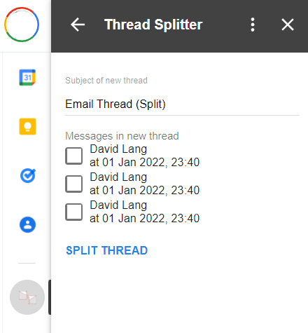

# Home
An add-on to split GMail threads.

Gmail conversation threads are great, but sometimes you get multiple emails about different things (eg. different orders) with an identical subject line, which Gmail automatically makes into threads. This add-on lets you split those emails into separate threads when required.

The add-on is hosted directly on Google Apps Script, free for anyone to use: (Google Workspace add-on url TBA)

## Fine print

Your emails are only stored in Gmail, your data does not leave Google's servers.
* Read more on the [privacy](privacy.md) and [terms of service](terms.md) pages.

If you like ThreadSplitter, feel free to [buy me a coffee](https://ko-fi.com/davidlang42).

As ThreadSplitter is open-source, you can find the full source code at: [https://github.com/davidlang42/threadsplitter](https://github.com/davidlang42/threadsplitter)
